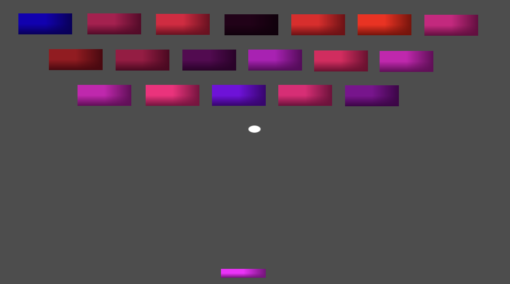

# 🧱 Arkanoid / Breakout - Godot 4 Clone

Prosty, ale w pełni grywalny klon klasycznej gry Arkanoid (Breakout), stworzony od podstaw w silniku Godot 4. Projekt powstał w celach edukacyjnych, aby poznać mechaniki fizyki 2D, obsługi kolizji oraz tworzenia interfejsu (UI) w silniku Godot.

## ✨ Główne funkcje
* **Płynne sterowanie paletką:** Stabilny ruch w poziomie z zablokowaną osią Y, co zapobiega spychaniu gracza przez fizykę silnika.
* **Fizyka piłki:** Okrągła piłka (zbudowana bez zewnętrznych grafik za pomocą `GradientTexture2D` i `CircleShape2D`), która odbija się od ścian i obiektów ze stałą prędkością.
* **System niszczenia klocków:** Kolorowe klocki zorganizowane w grupy silnika Godot (`Groups`). Kolory zostały nadane dynamicznie za pomocą właściwości `Modulate`.
* **Zarządzanie stanem gry (Game Loop):**
  * **Strefa porażki (Death Zone):** Ukryty obszar pod paletką, który wykrywa upadek piłki i restartuje poziom.
  * **System wygranej:** Dynamiczne sprawdzanie ilości klocków na planszy. Po zniszczeniu ostatniego gra pauzuje się i wyświetla okno UI z możliwością zagrania od nowa.
* **Proste zasoby:** Projekt "Zero Assets" – wszystkie grafiki zostały wygenerowane bezpośrednio w edytorze Godot.

## 🛠️ Technologie
* Silnik: **Godot Engine 4.x**
* Język: **GDScript**

## 🚀 Jak uruchomić?
1. Sklonuj to repozytorium na swój dysk.
2. Otwórz **Godot 4**.
3. Kliknij **Import** w menedżerze projektów i wybierz plik `project.godot` z pobranego folderu.
4. Uruchom grę klawiszem `F5`.
